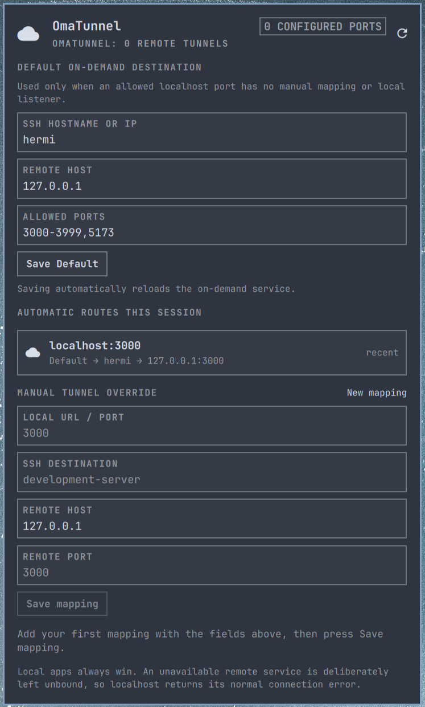

# OmaTunnel

> Remote development services that still feel like `localhost`.



OmaTunnel is an Omarchy Quickshell bar widget and SSH-forward manager. It
makes selected development-server ports available through `localhost`, without
exposing them beyond `127.0.0.1`.

## What it gives you

- **Local services always win.** A genuine listener is never replaced.
- **Manual mappings.** Explicitly map a local port to an SSH destination and
  remote host.
- **Optional all-localhost mode.** Use eBPF to route eligible missing localhost
  ports from browsers, `curl`, database clients, and development tools.
- **Visible state.** See active manual tunnels and automatic routes opened in
  the current service session.

## Choose a mode

| Mode | Best for | Privileges |
| --- | --- | --- |
| Manual tunnels | A known set of development ports | User-level only |
| On-demand forwarding | Any eligible missing localhost port | Optional `sudo` setup for eBPF |

## How it behaves

For every configured mapping, the service repeatedly checks the local port.

- If another local process listens on it, OmaTunnel does nothing: the local app wins.
- If the port is free and its remote target is reachable over SSH, OmaTunnel starts an SSH forward on `127.0.0.1:<local-port>`.
- If the remote target is unavailable, OmaTunnel does **not** open the local port. `localhost:<local-port>` therefore gets the ordinary connection-refused error.

This necessarily works for an explicit list of ports. An application cannot
intercept arbitrary `localhost:<port>` requests after the browser has already
received a network error; configuring mappings lets the service prepare those
ports before you open them.

Each mapping is tab-separated in `~/.config/omatunnel/ports.tsv`:

```tsv
# local_port  ssh_destination  remote_host  remote_port
3000	development-server	127.0.0.1	3000
```

`ssh_destination` is deliberately an SSH config host alias (for example
`development-server` in `~/.ssh/config`). This keeps identities, host-key
verification, ProxyJump, and non-standard SSH ports in OpenSSH rather than in
the plugin. OmaTunnel always uses `BatchMode=yes`; it never opens a password
prompt or disables host-key verification.

Normally you do not need to edit that file: click the OmaTunnel icon in the
top-right bar and use the panel's configuration fields to add or edit a
mapping. The fields are **Local URL / port**, **SSH destination**, **Remote
host**, and **Remote port**. Selecting an existing mapping loads it into the
form; saving applies it immediately, while removing it closes any forward that
OmaTunnel owns for that local port.

## Install

Install the bar widget from its public repository:

```bash
omarchy plugin add https://github.com/jvanbaarsen/omatunnel.git --enable
```

The widget requires the accompanying helper and user service. Run its installer
once from the installed plugin directory:

```bash
cd ~/.config/omarchy/plugins/jvb.omatunnel
./install
```

The installer copies the user helper and systemd unit, creates private
configuration files only if they do not already exist, starts the user service,
and enables the widget in the **top-right** of the Omarchy bar. Edit the
example mapping before using it:

```bash
$EDITOR ~/.config/omatunnel/ports.tsv
omatunnel reconcile
```

If you ever disable the widget, restore it to the top-right with:

```bash
omarchy plugin enable jvb.omatunnel right
```

OmaTunnel does not start another QuickShell process. Its bar-widget entry point
loads the panel in the existing Omarchy shell.

## Useful commands

```bash
omatunnel status --json
omatunnel reconcile
systemctl --user status omatunnel
journalctl --user -u omatunnel -f
```

The bar panel shows whether each mapping is currently served by a `tunnel`,
already occupied by a `local` process, or `unavailable` remotely.

## System-wide on-demand forwarding

The optional eBPF mode covers every TCP localhost client: browsers, `curl`,
database clients, and application processes. It is disabled by default.

Configure one Default SSH hostname, IP address, or SSH alias and a deliberately
limited list or range of remote ports in `~/.config/omatunnel/on-demand.conf`,
then enable it:

```bash
cd ~/.config/omarchy/plugins/jvb.omatunnel
./install --on-demand
```

Use `user@hostname` or `user@IP` when the remote SSH user differs from your
local username. The service uses non-interactive OpenSSH authentication, so the
destination must work with `BatchMode=yes` (normally an `IdentityFile` entry in
`~/.ssh/config` or an available unencrypted default key).

The installer builds the BPF program and uses `sudo` to enable a system service
with only `CAP_BPF`, `CAP_NET_ADMIN`, and `CAP_PERFMON`. SSH and the proxy run
as your own user. At each eligible `connect(2)` call, the BPF program looks up
the requested localhost TCP listener first. It leaves an existing listener
untouched; otherwise it redirects the connection to OmaTunnel's proxy, which
uses `ssh -W` to reach the same port on the configured remote host.

The proxy recovers the original port from the redirected client's TCP tuple,
so its own localhost listener cannot be confused with the requested
destination. The port list is also enforced in the BPF program; no other
localhost port is redirected.

Saving the Default through the panel automatically reloads the on-demand
service. The installer enables a systemd path watcher for `on-demand.conf`,
so no password prompt or manual restart is needed after edits.

The panel also shows automatic routes opened during the current service
session, with their active connection count or a `recent` marker.

Manual mappings remain available in the OmaTunnel panel. They are explicit
per-port overrides; the Default is only used for an eligible localhost port
without a local listener or a manual mapping.

Inspect its status with:

```bash
sudo systemctl status "omatunnel-ebpf@$USER.service"
journalctl -u "omatunnel-ebpf@$USER.service" -f
```

## Remove

From the installed plugin directory, remove the user-level helper and service:

```bash
./uninstall
omarchy plugin remove jvb.omatunnel
```

If you enabled system-wide on-demand forwarding, remove its privileged system
service first:

```bash
./uninstall --on-demand
omarchy plugin remove jvb.omatunnel
```

Removal preserves `~/.config/omatunnel/` so manually entered tunnel settings
are not lost. Remove that directory yourself only when you explicitly want to
discard your configuration.

## Security and dependencies

The widget runs in Omarchy's existing shell process with your user permissions.
The helper invokes only `ssh`, `ss`, `systemctl`, and standard shell utilities.
The optional on-demand mode additionally requires `clang`, `libbpf`, and sudo
because it loads an eBPF program with the limited capabilities documented
above. No credentials, SSH keys, or remote endpoints are stored in this
repository.
